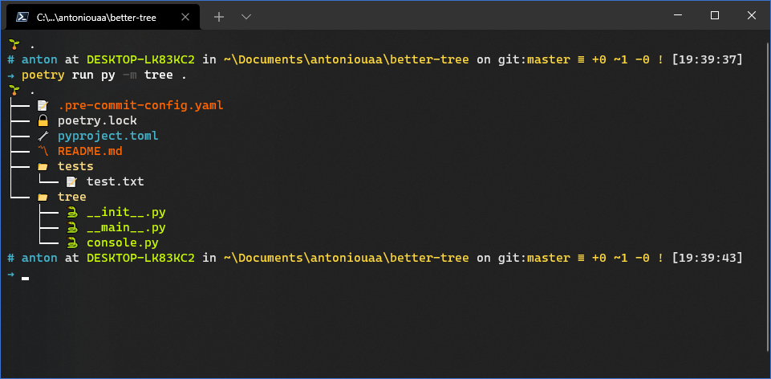

# better-tree

~~Cause regular tree is weak and no alternative (that works) exists.~~

Cause I'm bored out of my mind.



## Usage

```
usage: tree <Path> [options]

Tree utility in Python

positional arguments:
  Path               The path to search in

optional arguments:
  -h, --help         show this help message and exit
  --Depth DEPTH      Number of levels of depth
  --Include INCLUDE  Glob pattern to include in the search
  --File             Only show files
```

`better-tree` will not show hidden directories or files, or any files/directories whose names start with double underscores (`__`), eg `__pycache__`.

---

_Note: Specifying an `Include` flag of `"__*"` for example will still not show and files or directories starting with double underscores._

---

`Depth` defaults to indefinite, recursively going down level by level.
`File` defaults to False, if the flag is used `better-tree` will only display files, without showing depth.
